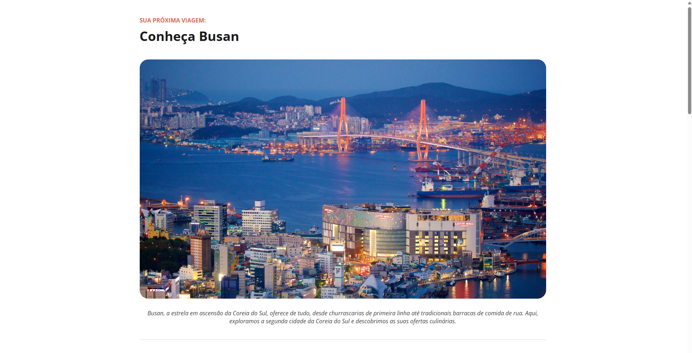

# Tourist Spot

Tourist destination landing page project created during studies.



## About

This project is a simple web page presenting the main tourist attractions of Busan, South Korea. The page highlights 3 must-see destinations for history lovers, including Buddhist temples and parks with panoramic views.

## Tech Stack

- HTML
- CSS

## Design

- [Figma](https://www.figma.com/design/lDwB5uzfwfGFtOndaRgxLA/Local-Tur%C3%ADstico--Community-?m=auto&t=FOmR5oypt2X7fFHP-6)

## How to run

```bash
# Clone this repository
git clone https://github.com/sillasemanoel/study-tourist-spot.git

# Enter the project folder
cd study-tourist-spot

# Open the index.html file in your browser
```

## Author

Sillas Emanoel
