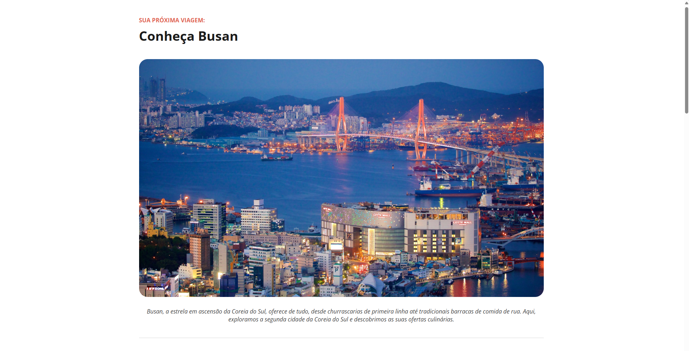

# Local Turístico

Página de destino turístico desenvolvida durante os estudos.



## Sobre

Projeto de uma página web apresentando os principais pontos turísticos de Busan, Coreia do Sul. A página destaca 3 destinos imperdíveis para amantes da história, incluindo templos budistas e parques com vistas panorâmicas.

## Tecnologias

- HTML
- CSS

## Design

- [Figma](https://www.figma.com/design/lDwB5uzfwfGFtOndaRgxLA/Local-Tur%C3%ADstico--Community-?m=auto&t=FOmR5oypt2X7fFHP-6)

## Como executar

```bash
# Clone este repositório
git clone https://github.com/sillasemanoel/study-tourist-spot

# Entre na pasta do projeto
cd study-tourist-spot

# Abra o arquivo index.html no seu navegador
```

## Autor

Sillas Emanoel
